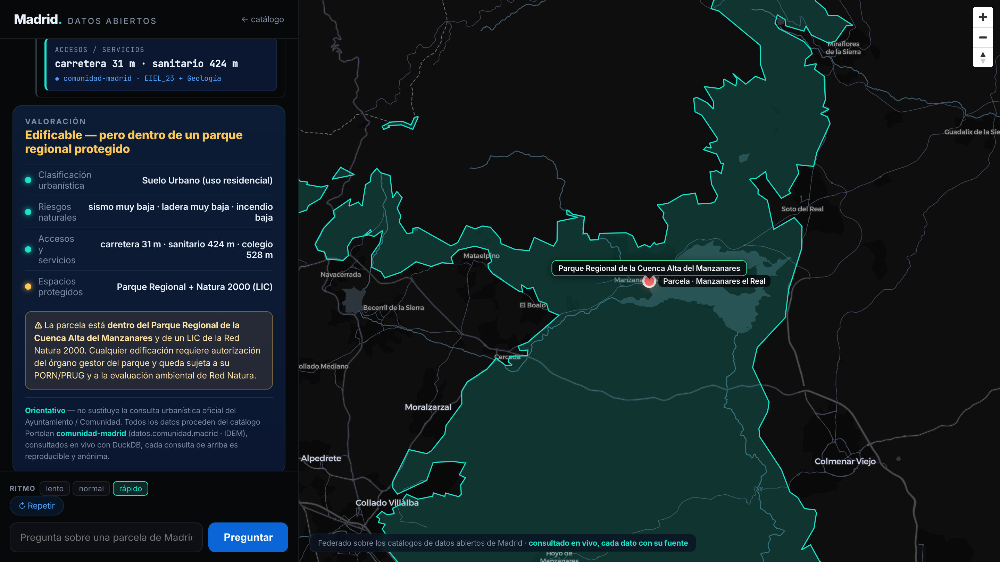

# Informe de mi dirección — ask Madrid's open data before you buy

A **Helsinki-style AI-conversation demo**: give a Madrid address and an agent geocodes it, **queries the
open-data catalogs live**, and tells you what the neighbourhood is like — *every figure carrying its
catalog · dataset · query*. The citizen use case: *"I'm thinking of buying here — what do the official
open datasets say about this location?"*

Its distinctive twist: it is **honest about coverage** — it shows where open data delivers **and where it
falls short or should be opened** (e.g. no air-quality history for the capital; no clean neighbourhood
time series). That gap map is part of the value.

> Sibling demo *"¿Puedo construir aquí?"* (plot buildability) still lives in `tools/build_scenario.py` /
> `tools/site_check.py`.



**Live demo:** `webapp/` → `index.html` (the federation) + `app.html` (the conversation + map).
Serve the folder: `python3 -m http.server -d webapp 8799`.

## How it works — prove it live, then script it
- **`tools/build_address_scenario.py`** — runs the **real** federated queries for one address and writes
  `webapp/data/scenario.json` (geocode + isochrone via CARTO LDS; suelo/riesgos, amenities, building, ambiente).
  Every tool card in the demo carries the real SQL + real result; nothing is fabricated. Honest gaps included.
  Run: `python3 tools/build_address_scenario.py "Calle de Alcalá 100, Madrid"`
  (needs `.lds.env` with a CARTO LDS API token — gitignored; `carto credentials create token`).
- **`webapp/`** — the conversation + map UI (MapLibre + **Catastro PMTiles** base, isochrone, parcel),
  replaying `data/scenario.json`. Same format as the OGC Connect Helsinki demo.
- **`.claude/skills/sdi/`** — the live agent loop (`SKILL.md`) + catalog registry (`catalogs.md`):
  *registry → catalog → dataset → query → assess*, so an agent can reproduce the run.

## The federated catalogs (all public, anonymous, cloud-native — queried in place)
| Catalog | Endpoint | Role |
|---|---|---|
| 🟥 **comunidad-madrid** (IDEM) | `…/carto-portolan-madrid/comunidad-madrid` | the decisive layers: planning classification & ordenanza, protected areas (ENP, Natura 2000, montes, vías pecuarias), natural hazards (vector levels + COG rasters), geology/soil, EIEL services. EPSG:25830 |
| 🐻 **madrid-opendata** | `…/carto-portolan-madrid/madrid-opendata` | city layers when the plot is in Madrid municipality (parks, air/noise stations). EPSG:4326 |
| 🗺️ **madrid-city** (Geoportal/IDEAM) | `…/carto-portolan-madrid/madrid-city` | base cartography (supporting). EPSG:25830 |
| 🟫 **catastro-es** (toda España) | `…/catastro-es-portolan` | the building & parcel at the address — uso, año, m² — as GeoParquet v3 + **PMTiles** base layer. EPSG:4326 |
| 🌍 **Overture** (global, remote) | `s3://overturemaps-us-west-2/.../places` | comparable amenities anywhere (schools, shops, health, food, parks). Queried in place, zero copy |
| 🧭 **CARTO LDS** | `carto sql query` + Analytics Toolbox | geocoding (address → point) + isochrones ("15 min walk") |

Base = `https://storage.googleapis.com/carto-portolan-madrid` (+ `catastro-es-portolan`). Built as
**Portolan** catalogs (Apache Iceberg + STAC + COG + PMTiles) in other sessions; this repo *uses* them.

## The demo scenario (Manzanares el Real) — real data
**✅ Suelo Urbano (edificable) — pero dentro del Parque Regional de la Cuenca Alta del Manzanares + Natura 2000 (LIC).**
Riesgos muy bajos; carretera a 31 m, centro sanitario a 424 m. → *Edificable, sujeto a la normativa del parque
(PORN/PRUG) y a evaluación de Red Natura.* Other plots run via the CLI: `reports/` (Parla ✅, Cercedilla ⛔, Madrid ℹ️ PGOUM).

## Run the screen on any plot
```bash
python3 tools/site_check.py <lat> <lon> "etiqueta"     # one plot → sourced report (reports/)
python3 tools/site_check.py --samples                   # the demo plots
python3 tools/build_scenario.py                         # rebuild the webapp conversation
```

## Honest framing
**Orientativo — no sustituye la consulta urbanística oficial.** Land classification is the regional
*refundido* (Madrid capital is governed by its **PGOUM**, flagged not classified). Hazards report the
source's 0–5 level (warn at ≥4). Protected areas don't forbid building but subject it to the park's rules.
Descriptive, not a permit decision. Every number keeps its catalog · dataset · query.
